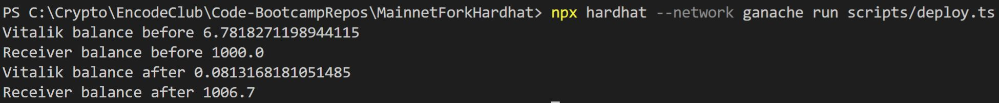

# MainnetForkHardhat

- Creation of a mainnet fork via ganache-cli
- Running RPC commands to simulate ETH transfer from Vitalik's account.
- Homework 17 of Encode Club bootcamp by ETHDenver.

Steps:

1. Run Ganache-CLI:

```
npx ganache --fork https://mainnet.infura.io/v3/<YOUR_KEY>@16690099 --unlock 0x1Db3439a222C519ab44bb1144fC28167b4Fa6EE6

```

Where 16690099 is the block number for #2 example screenshot. It's optional and can be removed.

2. Run the script:

```
npx hardhat --network ganache run scripts/deploy.ts

```

Recommended output:


Another way to run is using Infura Mainnet Fork with the command:

```
npx hardhat --network hardhat run scripts/deploy.ts

```
